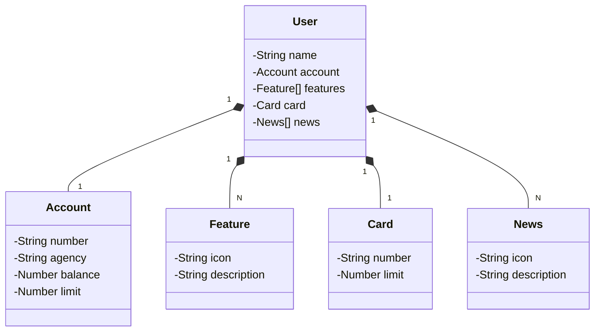

# Santander Dev Week 2023
Java RESTful API criada para a Santander Dev Week.

## Principais Tecnologias
- Java 17: Versão LTS mais recente do Java para tirar vantagem das últimas inovações que essa linguagem robusta e amplamente utilizada oferece;
- Spring Boot 3: Para maximizar a produtividade do desenvolvimento por meio de sua poderosa premissa de autoconfiguração;
- Spring Data JPA: Ferramenta utilizada para simplificar nossa camada de acesso aos dados;
- OpenAPI (Swagger): Documentação de API eficaz e fácil de entender, perfeitamente alinhada com a alta produtividade que o Spring Boot oferece;
- Railway: Facilita o deploy e monitoramento de nossas soluções na nuvem, além de oferecer diversos bancos de dados como serviço e pipelines de CI/CD.

## Diagrama de Classes

